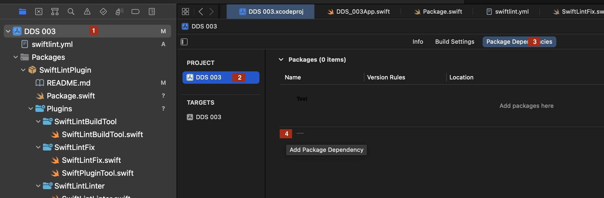
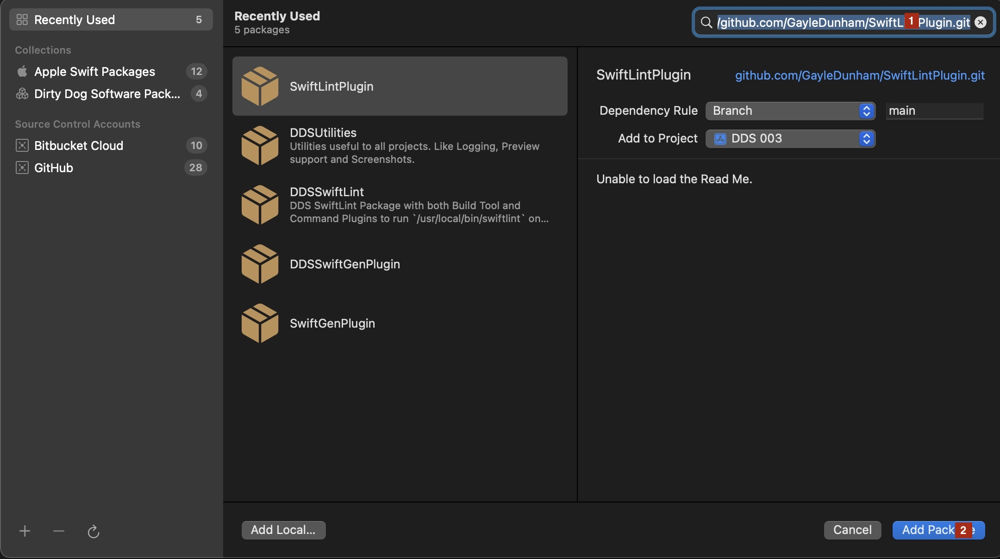
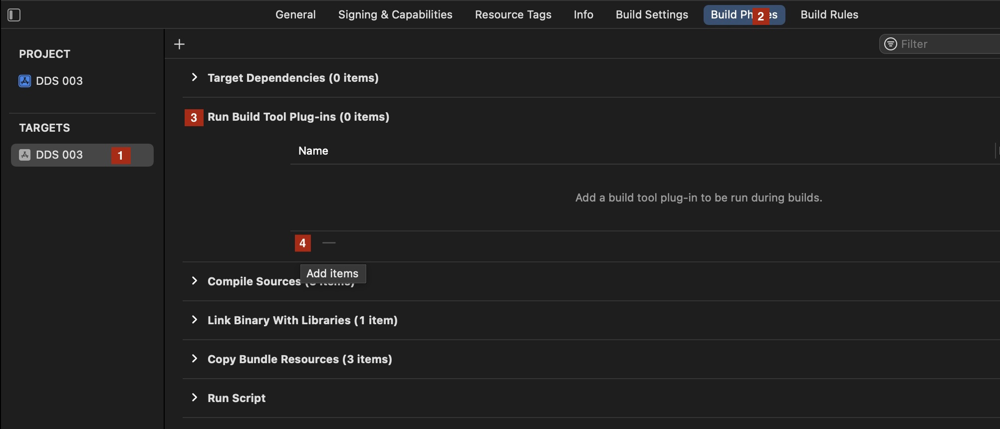
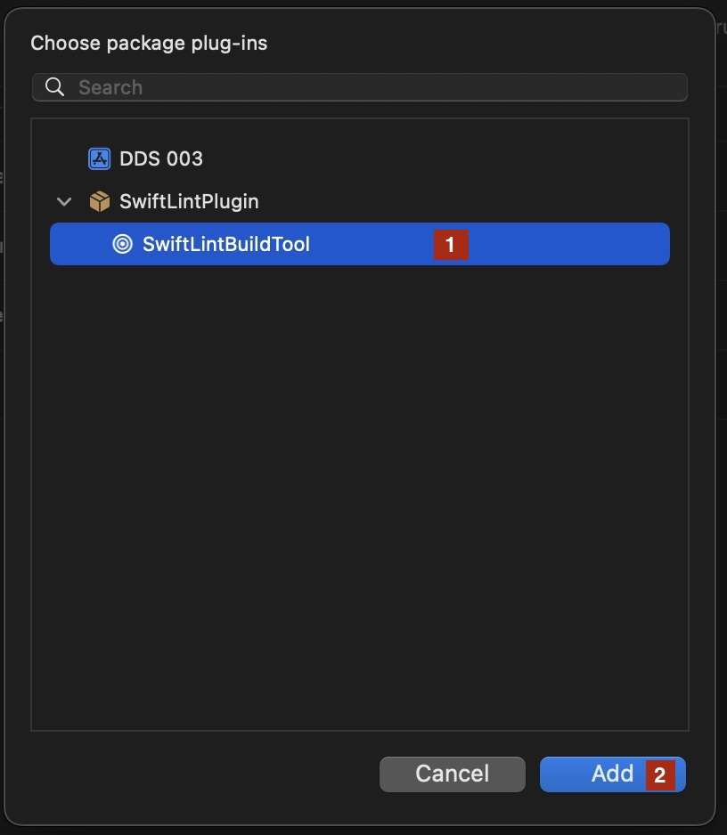
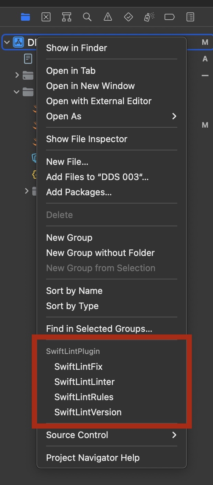
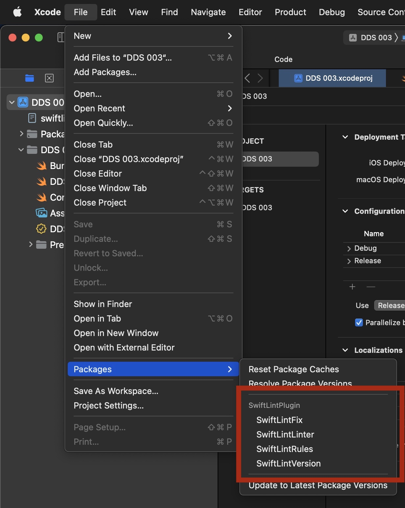

# SwiftLintPlugin
A Swift Package Manager Plugin for SwiftLint, supporting both Swift Packages and Xcode Projects. This package provides both plugin commands and a build tool command that runs before the build. For Packages, the plugin commands can be executed from both the command line and within Xcode.


# Installation

This Package contains a `binaryTarget` for the current released version 0.52.4 of swiftlint from [https://github.com/realm/SwiftLint/](https://github.com/realm/SwiftLint/) used by all the plugin commands and the build tool command. No installation of swiftlint or configuring of PATH is required.

> [!IMPORTANT]
> You do need either a `swiftlint.yml` or `.swiftlint.yml` file in the root folder of your package or project. The commands will fail if no configuration file can be found.

For more information on SwiftLint Rules see: [https://realm.github.io/SwiftLint/rule-directory.html](https://realm.github.io/SwiftLint/rule-directory.html)

# Swift Package Configuration

1. Add this Package `SwiftLintPlugin` as a dependency of your Package.

```swift
    dependencies: [
        .package(url: "https://github.com/GayleDunham/SwiftLintPlugin.git", branch: "main"),
    ],
```

2. Optionally: Add the `SwiftLintBuildTool` plugin to your main target all files in the package will be evaluated by the linter.

```swift
    targets: [
        .target(
            name: "YOUR_TARGET",
            dependencies: [],
            plugins: [ .plugin(name: "SwiftLintBuildTool", package: "SwiftLintPlugin") ]
        ),
```


# Xcode Project Configuration

### TL;)DR

1. Add the package `https://github.com/GayleDunham/SwiftLintPlugin` to the project. 
2. Optionally: Add the `SwiftLintBuildTool` plugin to the targets you want to be evaluated by the linter.

####

### Add the package to your Project.

1. In the Project Navigator select the first item (The Project)
2. In the Project Settings Editor select the Project
3. Then select the Package Dependencies tab
4. Click the + under the "Add package here" text



5. Paste https://github.com/GayleDunham/SwiftLintPlugin in the search box.
6. Click Add Package



### Optionally: Add the Build Tool to your Target.

7. Now Select the Target
8. Then select the Build Phases tab
9. Expand Run Build Tool Plug-in and Click the +



10. Select SwiftLintBuildTool and Click Add



# Features 

## Build Tool

The `SwiftLintBuildTool` is a pre-build command that runs swiftlint against a Target's sources directory. You must have a `swiftlint.yml` or `.swiftlint.yml` file in the root folder of the Package or Project

## Commands

Command are run against one or more selected Targets

- `SwiftLintFix`:       Correct violations whenever possible
- `SwiftLintLinter`:    Print lint warnings and errors
- `SwiftLintRules`:     Display the list of rules and their identifiers
- `SwiftLintVersion`:   Display the current version of SwiftLint


# Running Plugin Commands from Xcode

* To Run Commands from the Project Navigator: Right-click on the first item (The Project or Package) in the Project Navigator, then Click the Command to run.



* To Run Commands from the Menu: Select the first item (The Project or Package) in the Project Navigator. Then in the Menu, Select File -> Packages and the Command to run.



# Command Line Usage For Swift Packages

In the top-level directory of the Swift Package execute any of the following commands.

```sh
    % swift package swiftlint-fix
    % swift package swiftlint-lint
    % swift package swiftlint-rules
    % swift package swiftlint-version   
```

# xcodebuild Usage and CI systems

> [!NOTE]
> For CI Systems you should specify -skipPackagePluginValidation to skip the validation prompt that occurs in Xcode.

```sh
xcodebuild  \
    -scheme "YOUR_PROJECT" \
    -destination "platform=OS X,arch=x86_64" \
    -skipPackagePluginValidation \
    clean build
```

####

# References:

### SwiftLint

* SwiftLint Rule Directory Reference - [https://realm.github.io/SwiftLint/rule-directory.html](https://realm.github.io/SwiftLint/rule-directory.html)

* The Official raywenderlich.com SwiftLint Policy - [https://github.com/kodecocodes/swift-style-guide/blob/main/SWIFTLINT.markdown ](https://github.com/kodecocodes/swift-style-guide/blob/main/SWIFTLINT.markdown)
     
* com.raywenderlich.swiftlint.yml - The Official Kodeco Configuration file - [https://github.com/kodecocodes/swift-style-guide/blob/main/com.raywenderlich.swiftlint.yml ](https://github.com/kodecocodes/swift-style-guide/blob/main/com.raywenderlich.swiftlint.yml)

* The Official Kodeco Swift Style Guide - [https://github.com/kodecocodes/swift-style-guide ](https://github.com/kodecocodes/swift-style-guide)

* SwiftLee Blog: SwiftLint valuable opt-in rules to improve your code - [https://www.avanderlee.com/optimization/swiftlint-optin-rules/ ](https://www.avanderlee.com/optimization/swiftlint-optin-rules/)

* Swift API Design Guidelines - [https://www.swift.org/documentation/api-design-guidelines/ ](https://www.swift.org/documentation/api-design-guidelines/)

* Google Swift Style Guide - [https://google.github.io/swift/ ](https://google.github.io/swift/)

* LinkedIn Swift Style Guide - [https://github.com/linkedin/swift-style-guide ](https://github.com/linkedin/swift-style-guide)

* Airbnb Swift Style Guide - [https://github.com/airbnb/swift ](https://github.com/airbnb/swift)

### Swift Package Plugins

* WWDC 2022 Meet Swift Package plugins - [https://developer.apple.com/videos/play/wwdc2022/110359/ ](https://developer.apple.com/videos/play/wwdc2022/110359/)

* WWDC 2022 Create Swift Package plugins - [https://developer.apple.com/videos/play/wwdc2022/110401/ ](https://developer.apple.com/videos/play/wwdc2022/110401/)

* Xcode integration of Swift Package Plugins in Xcode 14 - [https://blog.eidinger.info/xcode-integration-of-swift-package-plugins-in-xcode-14 ](https://blog.eidinger.info/xcode-integration-of-swift-package-plugins-in-xcode-14)

* Beginner's guide to Swift package manager command plugins - [https://theswiftdev.com/beginners-guide-to-swift-package-manager-command-plugins/ ](https://theswiftdev.com/beginners-guide-to-swift-package-manager-command-plugins/)

* How to Use Xcode Plugins in Your iOS App - [https://betterprogramming.pub/how-to-use-xcode-plugins-in-your-ios-app-13574261f210 ](https://betterprogramming.pub/how-to-use-xcode-plugins-in-your-ios-app-13574261f210)
     
